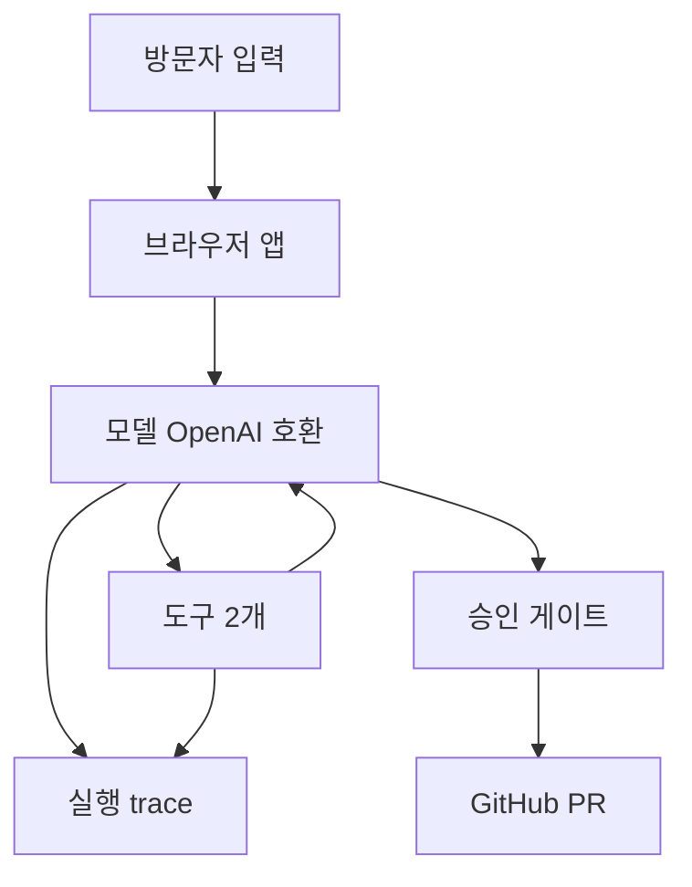

# blog-publisher

마크다운 초안을 검수해서 Hugo 블로그 저장소에 PR로 발행하는 완전 클라이언트사이드 웹앱. 백엔드 서버 없음.

배포 URL: `https://chictimin.github.io/blog-publisher/`

## 무엇을 하는 앱인가

- 입력: 마크다운 초안 전문, 대상 저장소(owner/repo), 방문자가 직접 입력한 OpenAI 호환 API 키·baseUrl과 GitHub PAT.
- 결과물: 대상 저장소 `content/blog/<slug>.md`를 추가하는 PR 1건. `main`에 직접 push하지 않고 PR까지만 만든다.

## 구조

서버가 없다. 모델 호출·GitHub API 호출·에이전트 루프가 전부 브라우저에서 돈다. 평가는 같은 코어를 UI 없이 Node에서 돌리는 headless 실행이다.

- src/core: 모델 호출·도구·루프. UI 의존 없음.
- src/ui: 화면.
- scripts: 평가 headless 실행.
- .github/workflows: 배포.

core와 ui를 분리한 이유: 같은 코어를 브라우저와 Node 양쪽에서 쓰기 위해서다. 평가 스크립트가 UI 없이 같은 루프를 돌리는 게 그 덕이다.



## 준비할 것

(a) **OpenAI 호환 API 키 + baseUrl** — 키 하나가 아니라 키·baseUrl 조합이다. CORS 실측(2026-09-10)으로 확인된 예시 2개: `https://api.openai.com/v1` (본가, 권장), `https://opencode.ai/zen/go/v1` (호환 게이트웨이). 권장은 본가다. 호환 게이트웨이는 공유 쿼터 소진으로 실행 중 끊길 수 있다. 값을 미리 채우지 않으며, 방문자가 제3의 제공자를 넣을 수도 있다. 모델 목록 조회와 실행에 사용한다.

(b) **GitHub fine-grained PAT** — 권한은 대상 저장소 1개 한정, 아래 2개만:

- Contents: Read and write
- Pull requests: Read and write

발급 경로: GitHub 우측 상단 프로필 → Settings → Developer settings → Personal access tokens → Fine-grained tokens → Generate new token → Repository access에서 대상 저장소 1개만 선택 → 위 2개 권한을 Read and write로 설정.

(c) **대상 저장소 전제** — Hugo 구조(`content/blog` 디렉토리, TOML frontmatter)여야 한다. 다른 레이아웃에서는 slug 검사 경로 기본값(`content/blog`)을 바꿔야 한다.

## 사용 순서

1. 설정 — 키 2개와 owner/repo 입력.
2. 모델 선택 — 목록은 키·baseUrl로 조회하며 기본 선택 없음. 고르지 않으면 실행 불가.
3. 초안 입력 — 마크다운 붙여넣기.
4. 실행 — 단계별 trace(도구 호출·결과, 토큰, 소요시간)를 목록으로 확인.
5. 승인 — 변경 요약(diffPreview)을 보고 승인·거절. 거절해도 오류가 아니다.
6. 결과 — PR 링크로 이동하거나 오류별 다음 행동 안내를 본다.

## 키 취급 방식

과제 사양은 "민감 정보를 환경변수로 관리"를 요구하지만, 이 앱에는 서버가 없어 환경변수를 둘 곳이 없다. 대신 방문자가 매번 직접 입력하는 BYOK 구조다.

- 키·baseUrl·토큰은 브라우저 탭 메모리에만 둔다. `localStorage`·`sessionStorage`에 저장하지 않으며, 새로고침하면 사라지고 다시 입력해야 한다.
- 모델 API를 브라우저에서 직접 호출하므로 키가 클라이언트 코드에 노출된다는 위험이 있다. `openai` 패키지 공식 문서에도 이 위험을 경고하는 문구가 있다. 그래서 타인의 키가 아닌 방문자 본인의 키·baseUrl로만 동작하도록 범위를 한정했다.
- CORS 허용 여부는 방문자가 입력한 baseUrl의 제공자에 달려 있고 앱이 통제할 수 없다. 차단되면 `CORS_BLOCKED` 안내가 나가며, 다른 baseUrl·키로 바꿔야 한다.

## 로컬 실행

```bash
npm install
npm run dev
npm run build
```

## .env 사용법

`.env.example`을 복사해 `.env`로 만들고 값을 채운다. `.env`는 커밋되지 않는다(`.env.example`만 커밋된다).

- 평가 스크립트용: `OPENAI_API_KEY`, `OPENAI_BASE_URL`, `GITHUB_TOKEN`, `EVAL_OWNER`, `EVAL_REPO`, `EVAL_MODELS`. Node 프로세스만 읽으므로 웹 번들에 들어가지 않는다. 실행은 `npm run eval`이며 `--env-file-if-exists`로 `.env`를 자동 로드한다. 모델 id를 모르면 `npm run eval -- --list-models`로 먼저 조회한다.
- 개발 편의용: `VITE_DEV_API_KEY`, `VITE_DEV_BASE_URL`, `VITE_DEV_GITHUB_TOKEN`, `VITE_DEV_REPO`. 개발 서버에서 폼을 자동 채우는 용도이며 `import.meta.env.DEV` 가드로 프로덕션 빌드에서는 항상 빈 값이다.
- 경고: `VITE_` 접두사 변수는 Vite가 빌드 산출물에 인라인한다. 값을 채운 뒤 로컬에서 빌드한 dist를 직접 배포하면 키가 노출되므로 로컬 산출물은 배포하지 않는다. 정상 배포는 GitHub Actions가 하며 러너에 `.env`가 없어 노출되지 않는다.
- 실측: 프로덕션 dist에서 `VITE_DEV_` 문자열 grep 결과 0건(2026-09-10 확인).

## 배포

GitHub Actions로 빌드해 GitHub Pages에 배포한다. 워크플로는 `.github/workflows/` 디렉토리 참조.

## 한계와 Out of Scope

- 이미지 업로드 미지원. 이미지가 포함된 초안은 경로 정리까지만 하고 에셋 업로드는 하지 않는다.
- 새로고침하면 입력한 키·실행 상태가 모두 초기화된다. 이어하기(재개) 없음.
- 발행 중간 실패 시 자동 롤백 없음. 부분 생성된 브랜치는 GitHub UI에서 직접 정리한다.
- 그 외 MVP 밖 선언: 포맷 학습 도구, 검수/발행 에이전트 분리, IndexedDB 재개, Web Worker 격리, 비용 단가 표시, MCP 서버, 자동 트리거, 로그인, 다크모드 토글.

## 평가

2026-09-10 실행. draft 3개 × 모델 2종(gpt-5.4-nano, gpt-5.4-mini) = 6회. 승인은 기본 거절이라 실제 PR 미생성.

- 결과: 6/6 승인 게이트 도달, 오류 0건. nano 평균 약 19.0초, mini 약 9.3초.
- 관찰 1: 병목은 두 번째 모델 호출(변환 결과 생성)로 전체의 84~94%다. 도구 실행은 2~3%라 GitHub API 왕복이 병목이 아니다.
- 관찰 2: 출력 토큰이 거의 같은데 nano가 mini보다 1.8~2.2배 느렸다(약 147 tok/s 대 317 tok/s). 작은 모델이 빠르다는 직관이 이 워크로드에서 성립하지 않았다.
- 한계: 승인을 거절했으므로 변환 정확도를 정답 포스트와 대조하지 못했다. 표의 완료는 승인 게이트 도달을 뜻한다. 6회 모두 성공해 실패 사례 표본이 없다. 조건별 1회 측정이라 분산을 모른다.
- 원본: experiments/20260910-114513/에 RESULTS.md와 trace-1..6.json이 있다. 재현 명령: npm run eval.

## 과제 평가 문항 대응

채점용 찾아보기다. 충족 여부 판단이 아니라 위치 안내다.

| 평가 문항 | 볼 것 |
|---|---|
| 1. PRD | PRD.md 1~5절 |
| 2. 도구 연결 | 도구 스키마·실패 처리는 PRD.md 4절과 src/core/tools.ts, 권한은 CONTRACT.md |
| 3. 에이전트 루프 | src/core/loop.ts, 종료 조건은 PRD.md 7절 |
| 4. 사람 개입·관찰가능성·평가 | 승인 게이트는 src/core/loop.ts와 src/ui/ApprovalCard.tsx, trace는 src/ui/TraceView.tsx, 평가 실측은 experiments/20260910-114513/RESULTS.md |
| 5. 배포 | 위 배포 URL과 .github/workflows/, 동작 범위는 아래 동작 확인 상태 |

## 동작 확인 상태

실측과 미검증을 구분한다.

- 실측 확인됨(2026-09-10): typecheck·build 통과, Pages 배포와 사이트 200 응답, 프로덕션 dist에 VITE_DEV_ 문자열 0건, OpenAI 호환 /v1/models 조회 성공, 평가 6회 완주, api.openai.com과 opencode.ai/zen/go/v1의 CORS 프리플라이트 허용, 브라우저에서 사용자 키로 승인 게이트 도달까지 동작(사용자 보고, 직접 관측 아님).
- 미검증: 승인 후 create_publish_pr이 실제로 PR을 생성하는 경로(승인 거절로 미호출), 승인 카드가 화면에 렌더됐는지(거절 종료 메시지는 확인됐으나 카드를 보고 거절했는지 구분 불가), 방문자가 제3의 baseUrl을 넣은 경우의 CORS.
