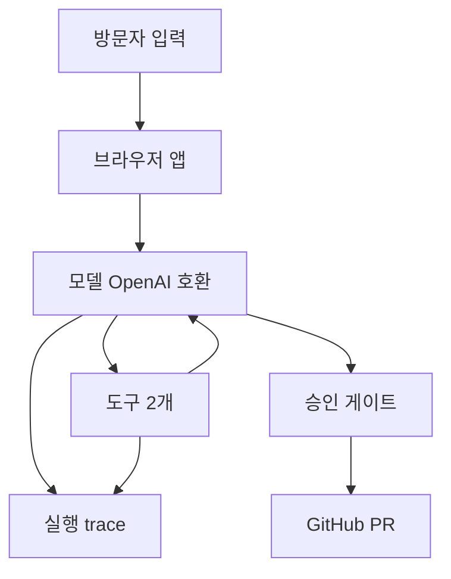

# blog-publisher

마크다운 초안을 검수해서 Hugo 블로그 저장소에 PR로 발행하는 완전 클라이언트사이드 웹앱. 백엔드 서버 없음.

배포 URL: `https://chictimin.github.io/blog-publisher/`

> **제출 범위 고지 (먼저 읽어주세요)**
>
> 이 저장소는 Main Quest "사용자와 함께 완성하는 제작 흐름"의 **확장 과제만** 담고 있다.
> 명세 6절이 요구하는 "카드뉴스 PRD를 자신이 자주 하는 작업으로 바꿔 구현하기"에 해당한다.
>
> **본편인 카드뉴스 제작 웹앱은 착수하지 않았다.** 명세 1~5절의 7단계 흐름(주제 입력·정보
> 선택·심층 조사·스토리보드 승인·이미지 제작·부분 수정·PNG/ZIP 내려받기)은 구현물이 없다.
> 제공된 키트(`card-news-workflow-kit/`)의 PRD와 ACCEPTANCE는 읽고 확장 설계의 출발점으로만
> 사용했다. 본편을 진행하려면 조사 엔진과 Antigravity 이미지 생성의 실제 인증·권한 확보가
> 선행되어야 하며, 그 준비를 마치지 못한 상태다.
>
> 명세 6절의 "확장이 끝나지 않았다면 카드뉴스 실습의 완료 범위와 확장의 미완료 범위를 따로
> 제출합니다" 조항을 역방향으로 적용해, **확장의 완료 범위만** 제출한다. 카드뉴스 본편은
> 미완료 범위다.
>
> 확장 과제 안에서 아직 못 한 것은 아래 미충족 항목에 따로 적었다.

## 무엇을 하는 앱인가

- 입력: 마크다운 초안 전문, 대상 저장소(owner/repo), 방문자가 직접 입력한 OpenAI 호환 API 키·baseUrl과 GitHub PAT.
- 결과물: 대상 저장소 `content/blog/<slug>.md`를 추가하는 PR 1건. `main`에 직접 push하지 않고 PR까지만 만든다.

## 구조

서버가 없다. 모델 호출·GitHub API 호출·에이전트 루프가 전부 브라우저에서 돈다. 평가는 같은 코어를 UI 없이 Node에서 돌리는 headless 실행이다.

- src/core: 모델 호출·도구·루프. UI 의존 없음.
- src/ui: 화면.
- scripts: 평가 headless 실행.
- .github/workflows: 배포.

core와 ui를 분리한 이유: 같은 코어를 브라우저와 Node 양쪽에서 쓰기 위해서다. 평가 스크립트가 UI 없이 같은 루프를 돌리는 게 그 덕이다.



## 준비할 것

(a) **OpenAI 호환 API 키 + baseUrl** — 키 하나가 아니라 키·baseUrl 조합이다. CORS 실측(2026-09-10)으로 확인된 예시 2개: `https://api.openai.com/v1` (본가, 권장), `https://opencode.ai/zen/go/v1` (호환 게이트웨이). 권장은 본가다. 호환 게이트웨이는 공유 쿼터 소진으로 실행 중 끊길 수 있다. 값을 미리 채우지 않으며, 방문자가 제3의 제공자를 넣을 수도 있다. 모델 목록 조회와 실행에 사용한다.

(b) **GitHub fine-grained PAT** — 권한은 대상 저장소 1개 한정, 아래 2개만:

- Contents: Read and write
- Pull requests: Read and write

발급 경로: GitHub 우측 상단 프로필 → Settings → Developer settings → Personal access tokens → Fine-grained tokens → Generate new token → Repository access에서 대상 저장소 1개만 선택 → 위 2개 권한을 Read and write로 설정.

(c) **대상 저장소 전제** — Hugo 구조(`content/blog` 디렉토리, TOML frontmatter)여야 한다. 다른 레이아웃에서는 slug 검사 경로 기본값(`content/blog`)을 바꿔야 한다.

## 사용 순서

1. 설정 — 키 2개와 owner/repo 입력.
2. 모델 선택 — 목록은 키·baseUrl로 조회하며 기본 선택 없음. 고르지 않으면 실행 불가.
3. 초안 입력 — 마크다운 붙여넣기.
4. 실행 — 단계별 trace(도구 호출·결과, 토큰, 소요시간)를 목록으로 확인.
5. 승인 — 변경 요약(diffPreview)을 보고 승인·거절. 거절해도 오류가 아니다.
6. 결과 — PR 링크로 이동하거나 오류별 다음 행동 안내를 본다.

## 키 취급 방식

과제 사양은 "민감 정보를 환경변수로 관리"를 요구하지만, 이 앱에는 서버가 없어 환경변수를 둘 곳이 없다. 대신 방문자가 매번 직접 입력하는 BYOK 구조다.

- 키·baseUrl·토큰은 브라우저 탭 메모리에만 둔다. `localStorage`·`sessionStorage`에 저장하지 않으며, 새로고침하면 사라지고 다시 입력해야 한다.
- 모델 API를 브라우저에서 직접 호출하므로 키가 클라이언트 코드에 노출된다는 위험이 있다. `openai` 패키지 공식 문서에도 이 위험을 경고하는 문구가 있다. 그래서 타인의 키가 아닌 방문자 본인의 키·baseUrl로만 동작하도록 범위를 한정했다.
- CORS 허용 여부는 방문자가 입력한 baseUrl의 제공자에 달려 있고 앱이 통제할 수 없다. 차단되면 `CORS_BLOCKED` 안내가 나가며, 다른 baseUrl·키로 바꿔야 한다.

## 로컬 실행

```bash
npm install
npm run dev
npm run build
```

## .env 사용법

`.env.example`을 복사해 `.env`로 만들고 값을 채운다. `.env`는 커밋되지 않는다(`.env.example`만 커밋된다).

- **비밀값은 프로젝트 밖에 둔다.** `OPENAI_API_KEY`, `OPENAI_BASE_URL`, `GITHUB_TOKEN`은 `~/.config/blog-publisher/env`(권한 600)에 넣는다. `npm run eval`이 그 파일과 프로젝트 `.env`를 함께 읽는다. 프로젝트 안의 파일을 편집하면 그 변경 내용이 AI 코딩 세션의 컨텍스트로 들어가므로, 키를 그 경로에 두지 않는다.
- 프로젝트 `.env`에는 비밀이 아닌 값만 둔다: `EVAL_OWNER`, `EVAL_REPO`, `EVAL_MODELS`. 두 파일 모두 Node 프로세스만 읽으므로 웹 번들에 들어가지 않는다. 실행은 `npm run eval`이며 `--env-file-if-exists`로 자동 로드한다. 모델 id를 모르면 `npm run eval -- --list-models`로 먼저 조회한다.
- 개발 편의용: `VITE_DEV_API_KEY`, `VITE_DEV_BASE_URL`, `VITE_DEV_GITHUB_TOKEN`, `VITE_DEV_REPO`. 개발 서버에서 폼을 자동 채우는 용도이며 `import.meta.env.DEV` 가드로 프로덕션 빌드에서는 항상 빈 값이다.
- 경고: `VITE_` 접두사 변수는 Vite가 빌드 산출물에 인라인한다. 값을 채운 뒤 로컬에서 빌드한 dist를 직접 배포하면 키가 노출되므로 로컬 산출물은 배포하지 않는다. 정상 배포는 GitHub Actions가 하며 러너에 `.env`가 없어 노출되지 않는다.
- 실측: 프로덕션 dist에서 `VITE_DEV_` 문자열 grep 결과 0건(2026-09-10 확인).

## 배포

GitHub Actions로 빌드해 GitHub Pages에 배포한다. 워크플로는 `.github/workflows/` 디렉토리 참조.

## 한계와 Out of Scope

- 이미지 업로드 미지원. 이미지가 포함된 초안은 경로 정리까지만 하고 에셋 업로드는 하지 않는다.
- 새로고침하면 입력한 키·실행 상태가 모두 초기화된다. 이어하기(재개) 없음.
- 발행 중간 실패 시 자동 롤백 없음. 부분 생성된 브랜치는 GitHub UI에서 직접 정리한다.
- 그 외 MVP 밖 선언: 포맷 학습 도구, 검수/발행 에이전트 분리, IndexedDB 재개, Web Worker 격리, 비용 단가 표시, MCP 서버, 자동 트리거, 로그인, 다크모드 토글.

## 평가

2026-09-10 실행. draft 3개 × 모델 2종(gpt-5.4-nano, gpt-5.4-mini) = 6회. 승인은 기본 거절이라 실제 PR 미생성.

- 결과: 6/6 승인 게이트 도달, 오류 0건. nano 평균 약 19.0초, mini 약 9.3초.
- 관찰 1: 병목은 두 번째 모델 호출(변환 결과 생성)로 전체의 84~94%다. 도구 실행은 2~3%라 GitHub API 왕복이 병목이 아니다.
- 관찰 2: 출력 토큰이 거의 같은데 nano가 mini보다 1.8~2.2배 느렸다(약 147 tok/s 대 317 tok/s). 작은 모델이 빠르다는 직관이 이 워크로드에서 성립하지 않았다.
- 한계: 승인을 거절했으므로 변환 정확도를 정답 포스트와 대조하지 못했다. 표의 완료는 승인 게이트 도달을 뜻한다. 6회 모두 성공해 실패 사례 표본이 없다. 조건별 1회 측정이라 분산을 모른다.
- 원본: experiments/20260910-114513/에 RESULTS.md와 trace-1..6.json이 있다. 재현 명령: npm run eval.

## 실패와 개선

명세가 요구하는 "정상 입력 한 번과 자료 부족 입력 한 번"을 실행했다. 자료 부족 입력은 `experiments/fixtures/insufficient-draft.md`로, 일부러 frontmatter 없음·TODO 마커 잔존·깨진 위키링크·없는 이미지 참조·본론 없음을 넣은 픽스처다. 모델은 gpt-5.4-mini 고정.

### 기대와 달랐던 사례

`experiments/20260910-141843/` (수정 전)

기대: 자료가 부족하면 부족하다고 알리고 멈춘다. 실제: **부족한 부분을 조용히 지우고 정상 발행처럼 승인 게이트까지 올라왔다.**

trace-2.json에서 확인한 것.

| 원문의 결함 | 에이전트가 한 일 | 문제 |
|---|---|---|
| `TODO: 여기에 실제로 무슨 일이 있었는지 쓰기` | 마커만 삭제 | 본문에 "여기에 실제로 무슨 일이 있었는지 쓰기"라는 무의미한 문장만 남음 |
| `[[아직-안-쓴-노트]]` (깨진 위키링크) | 일반 텍스트로 치환 | 링크가 깨져 있었다는 사실이 결과물에서 사라짐 |
| 없는 이미지 참조 | 그대로 유지하고 PR 본문에 "일반 이미지 참조는 유지했습니다" | 실재 여부를 확인하지 않고 확인한 것처럼 서술 |
| frontmatter 없음 | `draft = false`로 생성 | 머지하면 즉시 게시됨 |
| date 없음 | `2026-09-10T21:00:00+09:00` 생성 후 PR 본문에 "미래값이 아니도록 정리했다"고 서술 | 실행 시각은 14:19 KST. **실제로는 미래 시각이었고 설명과 값이 불일치** |

PR 본문이 "검수 결과: TODO 마커를 제거했고..."로 시작하는 성공 서술이라, 승인 카드만 보는 사람은 잘 처리된 것으로 읽기 쉽다.

### 원인

모델의 변덕이 아니라 프롬프트 설계 결함이었다. `src/core/prompt.ts`가

- 절차 4를 "create_publish_pr를 정확히 1회 호출해 발행한다"로 **무조건 발행**으로 지시했고, 중단 경로가 아예 없었다.
- 검수 항목 5개를 전부 "남지 않게 한다 / 바꾼다 / 채운다"처럼 **조용히 고치라는 지시**로 적었다. 발견한 문제를 보고하라는 요구가 없었다.
- frontmatter 규칙의 "시간이 없으면 `T21:00:00+09:00`을 붙인다"가 검수 항목 4("date가 미래면 고친다")와 정면으로 충돌했다. 오늘 날짜에 21시를 붙이면 그 자체가 미래가 된다.

에이전트는 지시대로 동작했다. 지시가 틀렸다.

### 바꾼 점

`src/core/prompt.ts`에 세 가지를 추가했다.

1. **검수 결과 보고 의무** — 발견한 문제를 지워서 없애지 않는다. `prBody` 맨 앞에 목록으로 넣고 항목마다 `[고침]`/`[못 고침]`을 붙인다. 확인하지 않은 것(이미지 실재 여부 등)은 "실재 미확인"으로 적는다.
2. **발행 중단 조건** — TODO 마커를 지우면 문장이 성립하지 않는 경우, 실질 문단이 하나도 없는 경우, 제목을 지어내야 하는 경우에는 `create_publish_pr`를 호출하지 않고 부족한 항목만 알리고 끝낸다.
3. **date 모순 수정** — date가 오늘이면 `T00:00:00+09:00`을 붙인다.

평가 스크립트에는 `--drafts` 인자를 추가해 평가 세트를 교체할 수 있게 했다(`scripts/eval-impl.ts`).

### 다시 실행한 결과

`experiments/20260910-142023/` (수정 후, 같은 입력·같은 모델)

**개선됨**

- PR 본문이 성공 서술이 아니라 검수 보고로 바뀌었다. `[못 고침] TODO 마커 잔존`, `[못 고침] 이미지 실재 여부는 확인할 수 없음`, `[고침] 깨진 위키링크: [[아직-안-쓴-노트]]를 일반 텍스트로 변경`처럼 원문의 어느 부분인지까지 남는다.
- 깨진 위키링크의 원래 형태가 보고에 보존됐다. 수정 전에는 사라졌다.
- date가 `2026-09-10T00:00:00+09:00`으로 바뀌어 미래 시각 문제가 없어졌다. 설명과 값도 일치한다.

**대가**

프롬프트가 길어진 만큼 토큰과 시간이 늘었다. 개선이 공짜가 아니었다.

| 입력 | 지표 | 수정 전 | 수정 후 |
|---|---|---|---|
| 부족 입력 | 입력 토큰 | 2,800 | 3,752 |
| 부족 입력 | 출력 토큰 | 470 | 573 |
| 부족 입력 | 소요 | 5,155ms | 5,595ms |
| 정상 입력 | 입력 토큰 | 6,422 | 7,374 |
| 정상 입력 | 출력 토큰 | 2,215 | 2,586 |
| 정상 입력 | 소요 | 13,582ms | 13,695ms |

입력 토큰 증가분(약 950)이 추가한 프롬프트 규칙의 분량이다. 조건별 1회 측정이라 분산은 모른다.

**아직 해결하지 못한 것**

- **중단 조건이 지켜지지 않았다.** 에이전트는 `[못 고침] ... 충분한 본문으로 볼 수 없음`이라고 스스로 판정하고도 `create_publish_pr`를 호출해 승인 게이트까지 올라왔다. 조건을 인식했지만 따르지 않았다.
- 다음 수정 방향: 중단을 프롬프트 지시가 아니라 **코드 게이트**로 옮긴다. `src/core/tools.ts`의 `create_publish_pr` 실행 직전에 본문 검사(실질 문단 수, TODO 제거 후 잔존 문장 길이)를 두고, 걸리면 도구를 실행하지 않고 `errorCode`로 종료시킨다. 프롬프트로 "하지 마라"를 거는 것보다 실행 경로를 막는 쪽이 확실하다. 다만 이건 판정 기준(몇 문단 이상이 실질인가)을 수치로 정해야 하고 그 기준을 분포에서 뽑아야 해서 이번 범위에 넣지 않았다.
- 승인 게이트가 최종 방어선으로는 동작했다. 사람이 거절하면 저장소에 아무것도 가지 않는다. 다만 승인 카드의 서술이 정직해진 것이 이번 수정의 실질적 성과이고, 자동 중단은 미해결이다.

## 과제 제출물 대응

Main Quest "사용자와 함께 완성하는 제작 흐름"의 **확장 과제**(명세 6절, 카드뉴스 흐름을 자기 작업으로 바꾸기) 제출물이다. 위 제출 범위 고지대로 **본편 카드뉴스 앱(명세 1~5절)은 미착수**이며, 아래 표는 확장 과제에 한정된 안내다. 충족 여부 판단이 아니라 위치 안내다.

| 제출 항목 | 볼 것 |
|---|---|
| 구현 결과와 실행 방법 | 위 배포 URL, 로컬 실행 절, `.github/workflows/` |
| PRD의 결정 (해결할 불편·기대 산출물·사람이 결정하는 지점) | `PRD.md` 1·5절, `DECISIONS.md` 1절과 D5 |
| 카드뉴스 PRD에서 가져온 것과 바꾼 것 | `DECISIONS.md` 0절 (입력·AI 판단·사람 결정·도구 행동·검수 5축 대응표) |
| 실행 증거 | `experiments/20260910-114513/` (RESULTS.md, trace-1..6.json). 재현: `npm run eval` |
| 실패와 개선 | 위 실패와 개선 절 (`experiments/20260910-141843/` → 수정 → `experiments/20260910-142023/`) |

제출 폴더 구성 요구사항 대응.

| 요구 파일 | 상태 |
|---|---|
| `README.md` (실행 방법) | 이 파일 |
| `PRD.md` | 있음 |
| `DECISIONS.md` (선택 이유) | 있음 |
| `API_SPEC.md` (화면과 서버의 약속) | 있음. 서버가 없으므로 화면↔코어·코어↔모델·코어↔GitHub 세 경계를 고정한다 |
| 실행 화면·결과 파일, 검증 기록 | `experiments/`와 아래 동작 확인 상태 |

`CONTRACT.md`는 병렬 작업 시 담당별 소유권과 인터페이스를 고정한 문서이며, 인터페이스 정본으로서 `API_SPEC.md`와 함께 읽는다.

### 미충족 항목 (정직한 기록)

- **본편 카드뉴스 앱 미착수.** 명세 1~5절의 7단계 흐름은 구현물이 없다. 명세가 허용하는 대안(모의 자료로 화면 작업만 진행하고 실제 조사·생성의 미완료를 기록하기)도 적용하지 않았다. 아래 항목들은 전부 확장 과제 안에서의 미충족이다.
- **자동 중단 미구현.** 자료 부족 입력에서 에이전트가 스스로 "충분한 본문으로 볼 수 없음"이라고 판정하고도 발행 도구를 호출한다. 승인 게이트에서 사람이 막을 수는 있으나 자동으로 멈추지는 못한다. 다음 수정 방향은 위 실패와 개선 절에 적었다.
- **새로고침 후 이어하기 없음.** 키를 메모리에만 두는 결정(`DECISIONS.md` D4)의 직접적 결과다. 트레이드오프와 뒤집을 조건은 D9에 적었다.
- **승인 후 실제 PR 생성 경로 미검증.** 평가 6회 모두 승인을 거절했다.

## 동작 확인 상태

실측과 미검증을 구분한다.

- 실측 확인됨(2026-09-10): typecheck·build 통과, Pages 배포와 사이트 200 응답, 프로덕션 dist에 VITE_DEV_ 문자열 0건, OpenAI 호환 /v1/models 조회 성공, 평가 6회 완주, api.openai.com과 opencode.ai/zen/go/v1의 CORS 프리플라이트 허용, 브라우저에서 사용자 키로 승인 게이트 도달까지 동작(사용자 보고, 직접 관측 아님).
- 미검증: 승인 후 create_publish_pr이 실제로 PR을 생성하는 경로(승인 거절로 미호출), 승인 카드가 화면에 렌더됐는지(거절 종료 메시지는 확인됐으나 카드를 보고 거절했는지 구분 불가), 방문자가 제3의 baseUrl을 넣은 경우의 CORS.
